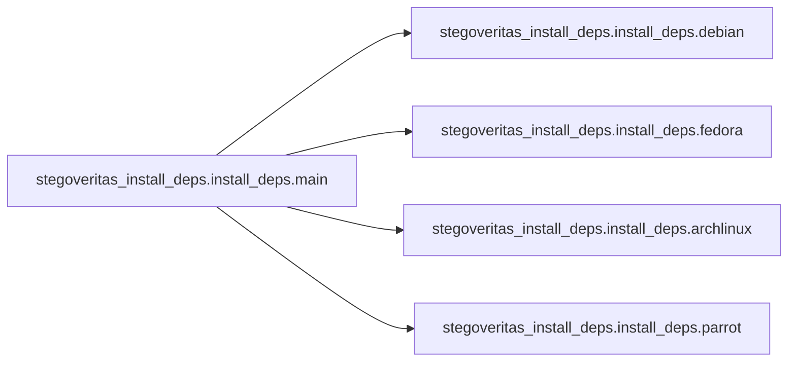

# Stegoveritas Install Deps Install Deps

[_Documentation generated by Documatic_](https://www.documatic.com)

<!---Documatic-section-Codebase Structure-start--->
## Codebase Structure

<!---Documatic-block-system_architecture-start--->
```mermaid
None
```
<!---Documatic-block-system_architecture-end--->

# #
<!---Documatic-section-Codebase Structure-end--->

<!---Documatic-section-stegoveritas_install_deps.install_deps.main-start--->
## stegoveritas_install_deps.install_deps.main

<!---Documatic-section-main-start--->


### Object Calls

* stegoveritas_install_deps.install_deps.debian
* stegoveritas_install_deps.install_deps.fedora
* stegoveritas_install_deps.install_deps.archlinux
* stegoveritas_install_deps.install_deps.parrot

<!---Documatic-block-stegoveritas_install_deps.install_deps.main-start--->
<details>
	<summary><code>stegoveritas_install_deps.install_deps.main</code> code snippet</summary>

```python
def main():
    dist_name = distro.name().lower()
    if dist_name in ['ubuntu', 'debian', 'kali', 'debian gnu/linux', 'kali gnu/linux', 'pop!_os', 'elementary os', 'deepin', 'pureos', 'linux mint']:
        debian()
    elif dist_name == 'fedora':
        fedora()
    elif dist_name in ['archlinux', 'arch', 'arch linux', 'manjaro', 'manjaro linux']:
        archlinux()
    elif dist_name == 'parrot gnu/linux':
        parrot()
    else:
        logger.error('Unhandled distribution to install deps: {}'.format(dist_name))
        logger.error('Please poke me or submit a PR.')
        return
```
</details>
<!---Documatic-block-stegoveritas_install_deps.install_deps.main-end--->
<!---Documatic-section-main-end--->

# #
<!---Documatic-section-stegoveritas_install_deps.install_deps.main-end--->

<!---Documatic-section-stegoveritas_install_deps.install_deps.debian-start--->
## stegoveritas_install_deps.install_deps.debian

<!---Documatic-section-debian-start--->
<!---Documatic-block-stegoveritas_install_deps.install_deps.debian-start--->
<details>
	<summary><code>stegoveritas_install_deps.install_deps.debian</code> code snippet</summary>

```python
def debian():
    packages = ['libimage-exiftool-perl', 'libexempi*', 'p7zip-full', 'foremost', 'steghide', 'libmagic1']
    subprocess.run(command_start + ['apt-get', 'update'])
    subprocess.run(command_start + ['apt-get', 'install', '-y'] + packages)
```
</details>
<!---Documatic-block-stegoveritas_install_deps.install_deps.debian-end--->
<!---Documatic-section-debian-end--->

# #
<!---Documatic-section-stegoveritas_install_deps.install_deps.debian-end--->

<!---Documatic-section-stegoveritas_install_deps.install_deps.fedora-start--->
## stegoveritas_install_deps.install_deps.fedora

<!---Documatic-section-fedora-start--->
<!---Documatic-block-stegoveritas_install_deps.install_deps.fedora-start--->
<details>
	<summary><code>stegoveritas_install_deps.install_deps.fedora</code> code snippet</summary>

```python
def fedora():
    packages = ['perl-Image-ExifTool', 'exempi', 'p7zip-plugins', 'foremost', 'steghide']
    subprocess.run(command_start + ['yum', 'install', '-y'] + packages)
```
</details>
<!---Documatic-block-stegoveritas_install_deps.install_deps.fedora-end--->
<!---Documatic-section-fedora-end--->

# #
<!---Documatic-section-stegoveritas_install_deps.install_deps.fedora-end--->

<!---Documatic-section-stegoveritas_install_deps.install_deps.archlinux-start--->
## stegoveritas_install_deps.install_deps.archlinux

<!---Documatic-section-archlinux-start--->
<!---Documatic-block-stegoveritas_install_deps.install_deps.archlinux-start--->
<details>
	<summary><code>stegoveritas_install_deps.install_deps.archlinux</code> code snippet</summary>

```python
def archlinux():
    packages = ['perl-image-exiftool', 'p7zip', 'foremost', 'steghide', 'exempi']
    subprocess.run(command_start + ['pacman', '-Syu'])
    subprocess.run(command_start + ['pacman', '-S'] + packages)
```
</details>
<!---Documatic-block-stegoveritas_install_deps.install_deps.archlinux-end--->
<!---Documatic-section-archlinux-end--->

# #
<!---Documatic-section-stegoveritas_install_deps.install_deps.archlinux-end--->

<!---Documatic-section-stegoveritas_install_deps.install_deps.parrot-start--->
## stegoveritas_install_deps.install_deps.parrot

<!---Documatic-section-parrot-start--->
<!---Documatic-block-stegoveritas_install_deps.install_deps.parrot-start--->
<details>
	<summary><code>stegoveritas_install_deps.install_deps.parrot</code> code snippet</summary>

```python
def parrot():
    packages = ['exempi', 'libimage-exiftool-perl', 'p7zip-full', 'foremost', 'steghide']
    subprocess.run(command_start + ['apt-get', 'update'])
    subprocess.run(command_start + ['apt-get', 'install', '-y'] + packages)
```
</details>
<!---Documatic-block-stegoveritas_install_deps.install_deps.parrot-end--->
<!---Documatic-section-parrot-end--->

# #
<!---Documatic-section-stegoveritas_install_deps.install_deps.parrot-end--->

[_Documentation generated by Documatic_](https://www.documatic.com)